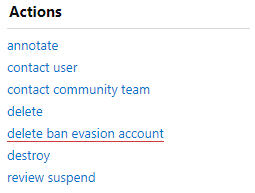
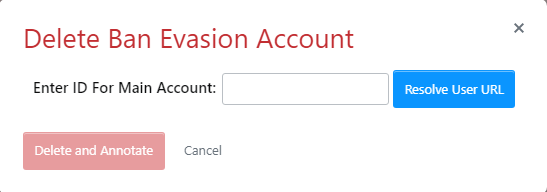
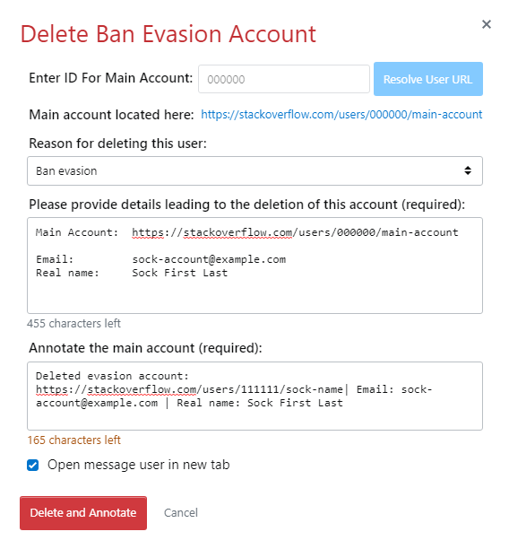

# Ban Evasion Account Delete Helper

This is UserScript provides a single interface to delete the ban evasion account, annotate the main account, and open a new window to send a mod message to the main account.

To use:
1. Access a user's account dashboard `/users/account-info`
2. On the left side under &ldquo;Actions&rdquo; a new link (button) has been added &lsquo;delete ban evasion account&rsquo; \
    \
   (This is underlined in red here for emphasis; it is not underlined normally)
3. Clicking this will open a 2-step form \
   
4.  Enter the user ID for the main account and click the &lsquo;Resolve User URL&rsquo; button. The ID field is a number input field (only numeric characters are accepted)
    - Warning: **almost no safety checks are made** for the user ID. The only invalid value is the current user's ID. Any other numeric value is accepted, please be sure you have the correct main account ID! 
    - Warning: you will be **accessing the sock account's PII** by clicking the &lsquo;Resolve User URL&rsquo; button 
5. The main account's full URL will be resolved and the deletion details and annotation details will be primed from the sock account's PII \
   
6. Choose a reason to delete the account from the select dropdown. The default is "This user was created to circumvent system or moderator imposed restrictions and continues to contribute poorly" _i.e._ "Ban evasion"
7. Finish filling out the deletion detail and annotation detail sections
8. Choose whether to open a new tab to send a mod message the main account after deletion and annotation (checked by default)
9. Click &lsquo;Delete and Annotate&rsquo;
10. Actions will be attempted in the following order (if any of the action fails the process will not continue):
    1. delete the sock account 
    2. annotate the main account
    3. open new tab `/users/message/create/` for the main account
    4. refresh current page

---

No data is persistent across page refreshes.

The &lsquo;Cancel&rsquo; button can be used at any time to **clear the form**. User PII is not stored so running the form again will result in accessing the sock's PII again.

The modal can be closed **without clearing** any of the form contents by clicking the &lsquo;X&rsquo; in the top right or using the <kbd>ESC</kbd> key.
